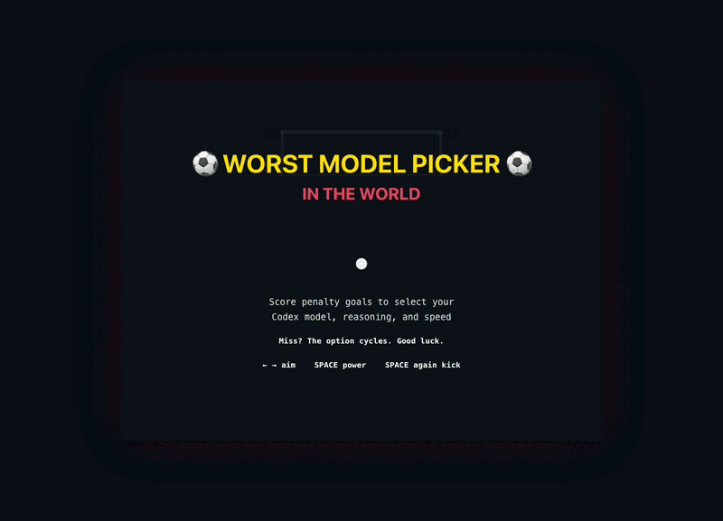

# Worst Model Picker in the World

> Remember the world's worst volume control? This is that, but for picking your Codex model.

<p align="center">
  
</p>

**[Play it live](https://adityavg13.github.io/CodexModelPickerUI/)**

You pick your Codex model, reasoning level, and speed by scoring penalty goals. Miss and the option cycles. The goalie gets harder each round.

## Add it to Codex

This repo is also a Codex plugin. From the repo root:

```bash
./install-codex-plugin.sh
codex plugin add worst-model-picker@personal
```

Then start a new Codex thread and ask:

```text
Open the worst model picker
```

The plugin bundles the game, adds a Codex plugin card, and exposes a launch skill that opens `index.html` locally.

## How to Play

| Control | Action |
|---------|--------|
| `← →` | Aim your shot |
| `Space` | Start power meter |
| `Space` (again) | Kick |
| `M` | Mute |
| `R` | Restart |
| `Esc` | Back to title |

## The Picks

**Round 1 - Model:** GPT-5.5, GPT-5.4, GPT-5.4-Mini, GPT-5.3-Codex-Spark

**Round 2 - Reasoning:** Low, Medium, High, Extra High

**Round 3 - Speed:** Standard, Fast

The goalie reads your kick better each round, dives faster, sways less. Wind shifts every attempt. Too little power and it's an easy save; too much and the ball sails over the bar.

## Stack

One file. Zero dependencies. `index.html`.

Inspired by [@ajambrosino's tweet](https://x.com/ajambrosino/status/2068441809555222572) about making a "worst UI" model picker.
